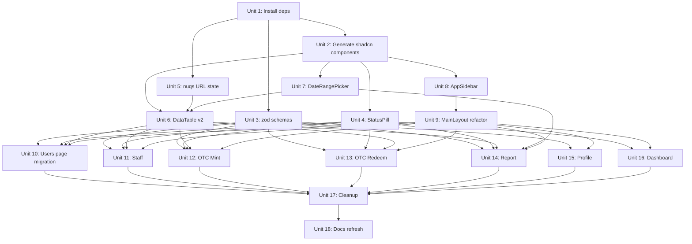

# feat: UI polish foundation — data-table, forms, sidebar

## Overview

Adopt the off-the-shelf component stack and visual chrome patterns we documented in `docs/brainstorms/2026-04-29-ui-polish-pattern-analysis.md` and `docs/brainstorms/2026-04-29-component-stack-audit.md` into the USDX Back Office. The work is **infrastructural-first, restyle-second**: most of the visual delta is small because our codebase already shipped the "Linear Console" monochrome direction in commit `e8af999`, which is broadly aligned with the reference's "black solid primary, color reserved for data" philosophy. The real effort is adding the libraries and one feature-rich `DataTable<T>` abstraction that makes every list page feel uniformly polished.

**User-confirmed scope (2026-04-29):**

1. Stack adoption + chrome restyle to the reference (not full IA mirror).
2. Phased migration: Foundation → page-by-page → cleanup.
3. shadcn Sidebar block penuh; **drop BottomNav and MoreDrawer** in favor of the shadcn Sidebar's built-in mobile sheet.

## Problem Frame

We have a working USDX Back Office on React 19 + Vite 8 + Tailwind v4 + shadcn/ui + TanStack Table v8 + TanStack Query v5. After analyzing the reference (a more-mature reference admin in the same domain space), three quality gaps stood out:

1. **Tables are inconsistent and feature-thin.** Our `src/components/DataTable.tsx` supports sort, basic pagination, and toolbar slot. It does not support row selection, column visibility toggle, column resize, an advanced-filter popover, or a page-size selector. Filter UX varies per page because each page implements its own toolbar.
2. **Forms are hand-rolled.** Every feature form (`OtcMintForm`, `UserModal`, `StaffModal`, `PersonalDetailsForm`) uses local `useState` plus pure validators in `src/lib/validators.ts`. UX rules (validate on blur after first interaction, re-validate on change once touched, modal disables Esc/outside-click during pending) are duplicated in each form. There is no zod, no `react-hook-form`, and no shadcn `<Form>` wrapper. Adding a new field is a four-file change.
3. **Status pills, sidebar, and URL state are duplicated or hand-rolled.** Status pills exist as config in `src/lib/status.ts` but no `<StatusPill>` component — every consumer renders a `<span>` with the config. The sidebar (`src/components/layout/Sidebar.tsx`) is custom — no `SidebarProvider`, no built-in collapse or accessibility, no mobile sheet. URL state in tables is hand-rolled via `useSearchParams` with no schema typing.

The component-stack audit (`docs/brainstorms/2026-04-29-component-stack-audit.md`) confirmed that the same gaps in *their* app would have been solved by `nuqs` + `react-hook-form` + `zod` + `react-day-picker` + the shadcn Sidebar block + a single typed `DataTable<T>` wrapper. None of that is proprietary; everything is `npx shadcn add …` plus a few `pnpm add` commands. Their consistency comes from picking *one* abstraction per concern and using it everywhere.

This plan operationalizes that adoption.

## Requirements Trace

- **R1.** Every list page (Users, Staff, OTC Mint requests, OTC Redeem requests, Report) uses one `DataTable<T>` component supporting: sort, per-column filter funnel, global filter input, advanced-filter sheet/popover, column visibility toggle, column resize, row selection, page-size selector, pagination, loading state, empty state, CSV export. *(see origin: `docs/brainstorms/2026-04-29-component-stack-audit.md` §3 table superpowers, §7 component-by-component)*
- **R2.** Table state (sort, page, page size, filters) persists to the URL via `nuqs`, using a typed parser layer. Existing query-key format (`?page=2&sortBy=...`) is preserved so MSW handlers and existing test assertions do not break. *(origin §6 URL state)*
- **R3.** Every form (OTC Mint, OTC Redeem, User add/edit, Staff invite, Profile personal details) uses `react-hook-form` + `zod` + shadcn `<Form>` wrapper, while preserving existing UX rules: blur-after-first-interaction, change-after-touched, disabled-during-pending, success closes/resets/refocuses, error toast + preserved values. *(origin §4 forms; CLAUDE.md "Form / modal conventions")*
- **R4.** A single `<StatusPill>` component (filled style, reference-aligned) replaces every inline pill in the codebase. Consumers pass a `status` value; styling is centralized. *(origin §6 status pills; analyst report §7)*
- **R5.** The custom `src/components/layout/Sidebar.tsx` is replaced by the shadcn Sidebar block (`SidebarProvider`, `Sidebar`, `SidebarMenu`, `SidebarMenuButton`, `SidebarMenuSub*`, `SidebarRail`, `SidebarTrigger`, `SidebarInset`, `SidebarFooter`). Menu items move to a single config file. Custom Sidebar code is deleted. *(origin §6 sidebar)*
- **R6.** `BottomNav.tsx` and `MoreDrawer.tsx` are removed. Mobile navigation uses the shadcn Sidebar's built-in mobile Sheet, triggered by a `SidebarTrigger` (hamburger) in the top bar. CLAUDE.md is updated to reflect the new mobile pattern. *(user decision 2026-04-29)*
- **R7.** Date inputs (currently a single `Pick a date` placeholder used in the Report filter) use a shadcn `Calendar` (react-day-picker) inside a `Popover`. Date range inputs use a `<DateRangePicker>` with a side-panel of presets (Last hour / 7 days / 14 days / 30 days) and Custom range Start/End datetime fields, mirroring the reference admin's pattern. *(origin §4 calendar)*
- **R8.** Page-header CTA convention: the **primary action** (`+ New …`, `Invite`, `Save`) lives in the right slot of `<PageHeader>`. Toolbar chrome (filter input, advanced filter button, view toggle, export) lives **inside** the `DataTable` toolbar. *(origin §4 page-header pattern)*
- **R9.** Filled status pills (reference-style: solid background, white text) replace soft-tint pills (`bg-success/10 text-success`). Color tokens for filled variants come from existing `--success`, `--warning`, `--destructive` HSL vars. *(origin §3 color system)*
- **R10.** Existing test suite (Vitest unit + Playwright E2E) stays green at every Phase boundary. Tests that assert URL search params and form error labels continue to pass without modification through Phase 1 and Phase 2.

## Scope Boundaries

- **Out of scope — IA restructure:** No splitting of pages to mirror the reference admin's Subscribe → Request/Fulfill/Settlement pattern. Our domain is single-shot OTC; we keep our existing route structure (`/users`, `/staff`, `/otc/mint`, `/otc/redeem`, `/report`, `/profile`, `/dashboard`).
- **Out of scope — full Activity feed page:** We adopt the *visual styling* of the reference's activity feed in the Dashboard's `RecentActivityList`, but do not build a standalone `/activity` page.
- **Out of scope — icon library swap:** Stay on `lucide-react` (already wired into Sidebar, Navbar, BottomNav, every page). Do not introduce `@tabler/icons-react`. Visual difference is negligible; cost is high.
- **Out of scope — `next-themes`:** Our `src/components/ThemeToggle.tsx` is hand-rolled and works. Do not add `next-themes` (Vite-compatible but not worth the churn given the existing implementation).
- **Out of scope — `cmdk` command palette:** the reference does not use it either; we have a decorative search box in `Navbar` we can leave alone or remove later.
- **Out of scope — chart-component refactor:** `recharts` Dashboard volume chart stays as-is.
- **Out of scope — auth or RBAC changes:** Mock auth in `src/lib/auth.tsx` stays; the v1 risks documented in CLAUDE.md remain on the docket but are not addressed here.
- **Out of scope — backend / API changes:** No MSW handler signatures change (R2 makes this an explicit non-goal).

## Context & Research

### Repository state today (verified by repo-research-analyst on 2026-04-29)

**Already in `package.json`:** React 19, Vite 8, Tailwind v4, shadcn (18 components), TanStack Table v8, TanStack Query v5, sonner, lucide-react, recharts, MSW, Vitest, Playwright, plus Radix `react-checkbox`, `react-dialog`, `react-dropdown-menu`, `react-label`, `react-radio-group`, `react-select`, `react-separator`, `react-slot`, `react-switch`, `react-tooltip`. **Router is `react-router` v7 (not Next.js).**

**Missing libraries (must add):** `react-hook-form`, `zod`, `@hookform/resolvers`, `nuqs`, `react-day-picker`, plus Radix `react-popover`, `react-avatar`, `react-collapsible`, `react-tabs`, `react-alert-dialog`, `react-scroll-area`, `react-accordion`.

**Missing shadcn components (must generate via CLI):** `form`, `popover`, `calendar`, `command`, `tabs`, `avatar`, `breadcrumb`, `collapsible`, `sidebar`, `alert-dialog`, `scroll-area`. Existing 18: `badge, button, card, checkbox, dialog, dropdown-menu, input, label, radio-group, select, separator, sheet, skeleton, sonner, switch, table, textarea, tooltip`.

### Critical contradictions surfaced during research

These came up during the analyst pass and adjust earlier brainstorm assumptions:

1. **`bg-blue-pulse` does not exist.** The teal-gradient CTA from Azure Horizon has been removed; current `--primary` is a flat `hsl(var(--primary))`. The codebase already aligns with the reference's monochrome philosophy.
2. **Token names diverge from CLAUDE.md.** `surface*`, `on-surface*`, `outline-variant`, `primary-container` are no longer present. The current `src/index.css` uses standard shadcn names (`background`, `card`, `border`, `muted`, `accent`, etc.). Root `CLAUDE.md` is **partly stale** and should be updated as part of the documentation phase.
3. **Recent design exploration:** `docs/design-explorations/02-linear-console.html` is the chosen current direction. It is broadly compatible with the reference's monochrome chrome. Treat it as authoritative for typography, hairline borders, and dark-mode flat black, except where the reference admin's more developed Table/Form chrome offers clearer patterns.
4. **The previous Azure Horizon plan** (`docs/plans/2026-04-16-001-feat-azure-horizon-redesign-plan.md`) is superseded for color/CTA decisions. Do not regress to its assumptions.

### Relevant code and patterns

- **DataTable contract** lives in `src/components/CLAUDE.md` and is read by every list page.
- **Feature-based organization** rule (`src/features/CLAUDE.md`): pages, modals, hooks, types live in `src/features/<name>/`.
- **Business logic in `src/lib/`** (`src/lib/CLAUDE.md`): pure, testable, no React imports.
- **Form UX rules** (root `CLAUDE.md`): validate on blur after first interaction; re-validate on change once a field is touched; submit revalidates all; modal Esc / outside-click disabled while a mutation is in flight; submit button shows spinner + "Submitting…"; on success the modal closes, form resets, focus returns to first field; on error a toast fires while modal stays open with values preserved. **RHF + zod migration must replicate this UX exactly**, not just call `<Form>` and call it done. Implementation units that touch forms must reference these rules in their Approach.
- **Test convention** (root `CLAUDE.md`): `describe('functionName', () => { describe('positive'|'negative'|'edge cases') })`.
- **shadcn `src/components/ui/` is generated — do not edit manually.** Customizations live in consumers or `src/index.css` tokens.

### Institutional learnings

`docs/solutions/` does not exist in this repo. There is no prior-incident corpus to draw on. This refactor will be the first compounding event for several topics; Phase 3 (Documentation) seeds initial entries.

### External references

External research was not run as a separate phase — the source material in `docs/brainstorms/2026-04-29-component-stack-audit.md` is itself the external reference, and the libraries involved (TanStack Table, shadcn, RHF, zod, nuqs) are well-established with strong docs that the implementing agent can consult during execution. Key URLs to keep handy:

- `nuqs` adapter for React Router v7: `https://nuqs.47ng.com/docs/adapters/react-router`
- shadcn Sidebar block: `https://ui.shadcn.com/docs/components/sidebar`
- shadcn Form (RHF wrapper): `https://ui.shadcn.com/docs/components/form`
- TanStack Table v8 column resizing & faceted filters: `https://tanstack.com/table/v8/docs/framework/react/examples/column-sizing`, `https://tanstack.com/table/v8/docs/framework/react/examples/column-visibility`
- react-day-picker v9: `https://daypicker.dev/`

## Key Technical Decisions

- **Adopt nuqs over hand-rolled `useSearchParams`.** Type-safe parsers, batched updates, identical query-string output (we control the keys). Use `nuqs/adapters/react-router/v7`. Provider mounts once in `src/App.tsx`.
- **Adopt react-hook-form + zod + shadcn `<Form>` for all forms.** Single shared resolver pattern; existing validators in `src/lib/validators.ts` port 1:1 to zod schemas in `src/lib/schemas.ts`. Keep validators.ts compiling until all consumers swap (Phase 2), then delete in Phase 3.
- **Build a new `DataTable v2`, not in place.** Land it as a new component (`src/components/DataTable.tsx` rewritten in one PR with feature flag opt-in OR added alongside as `DataTableV2.tsx`). Migrate consumers one at a time. The current API (server-side mode + columns + data) is mostly compatible, so we will rewrite in place but pre-verify each consumer's call site fits the new prop shape during Unit 6.
- **Replace Sidebar.tsx with shadcn Sidebar block.** Drop `BottomNav` and `MoreDrawer`. Mobile navigation uses the built-in shadcn Sidebar mobile sheet. Trigger lives in top bar (replaces hamburger logic).
- **Filled status pills.** Wrap shadcn `Badge` in a `<StatusPill>` with cva variants. Filled style: solid `bg-success`, `bg-warning`, `bg-destructive` + `text-white`. Soft-tint stays available as a fallback variant for non-status uses.
- **Stay on lucide-react.** Skip Tabler icon swap. Visual difference is too small for the migration cost.
- **Keep recharts.** Dashboard chart is fine; not a target.
- **Preserve URL query-key format.** nuqs lets us define exact key names. Use `page`, `pageSize`, `sortBy`, `sortOrder`, `q`, `status`, `dateFrom`, `dateTo` — same as today, so MSW handlers and existing tests are unaffected.
- **No feature flags.** Phased migration is per-page in separate PRs; no runtime toggle needed. The new DataTable replaces the old in one Unit 6 PR; subsequent page PRs migrate forms and pills.
- **CSS tokens stay shadcn-standard.** No re-introduction of Azure Horizon names. Tweak only the filled-pill bg-class mapping if needed.

## Open Questions

### Resolved during planning

- **Visual scope?** Stack + chrome restyle to the reference (not full IA mirror). User decision 2026-04-29.
- **Migration strategy?** Phased: Foundation → page-by-page → cleanup. User decision 2026-04-29.
- **Mobile nav pattern?** Drop BottomNav; shadcn Sidebar mobile sheet replaces it. User decision 2026-04-29.
- **Icon library?** Stay on lucide-react. Decided in Scope Boundaries.
- **next-themes?** Skip — keep hand-rolled `ThemeToggle.tsx`. Decided in Scope Boundaries.
- **DataTable parallel vs in-place rewrite?** In-place rewrite of `src/components/DataTable.tsx` after pre-verifying current call sites in Unit 6. Avoids dead-code duplication.

### Deferred to implementation

- **shadcn Sidebar block + react-router NavLink integration.** The block ships with assumptions about Next.js `<Link>`. The implementing agent should adapt `<SidebarMenuButton asChild>` with `<NavLink>` and confirm active-state styling works. Verify when running Unit 8.
- **Exact Advanced Filter UX shape per column type.** the reference renders form fields per column type (text → input, enum → Select, date → DateRangePicker, number → Min/Max). The implementing agent should drive this from `ColumnDef.meta.filterType` (or similar TanStack metadata) and decide whether the panel is a Sheet (slide-in) or Popover (anchored). Resolve in Unit 6.
- **Row-click → modal preview** for OTC list rows. Today the rows are static. We may add an `onRowClick` slot to `DataTable v2` and let pages opt in. Validate during Unit 12 (OTC Mint) and Unit 13 (OTC Redeem) migrations.
- **Date format in URL.** ISO 8601 (`2026-04-29`) is the obvious choice for `dateFrom` / `dateTo`, but the existing implementation may use a different format. Verify before nuqs port (Unit 5).
- **CSV export module location.** `src/lib/csv.ts` exists and works. Decide whether DataTable v2 calls it directly or pages pass a per-page export handler.

## High-Level Technical Design

> *This illustrates the intended approach and is directional guidance for review, not implementation specification. The implementing agent should treat it as context, not code to reproduce.*

### Phase dependency graph



### `DataTable v2` anatomy (sketch only)

```text
<DataTable<T>
  data
  columns                        // ColumnDef<T>[] with optional .meta.filterType
  totalRows
  isLoading
  serverState                    // sort, pagination, filter values - sourced from nuqs
  onServerStateChange            // setters - delegated to nuqs
  onRowClick?                    // opens detail (e.g., OTC Preview Request modal)
  csvExport?                     // (rows) => void; falls back to lib/csv.ts
  toolbarLeftSlot?               // page-supplied custom filter UI
/>
  ┌─ Toolbar ──────────────────────────────────────────────────────────────┐
  │ [Filter input]      [Advanced Filter button] [Toggle columns] [Export] │
  └────────────────────────────────────────────────────────────────────────┘
  ┌─ Table ────────────────────────────────────────────────────────────────┐
  │ [☐] [ID ⇅ ⛛] [Request ID ⇅ ⛛] [Date ⇅ ⛛] … [Status ⛛] [Actions]      │
  │ [☐]  …rows…                                                            │
  │     <ColumnResizeHandle />  per <th>                                   │
  └────────────────────────────────────────────────────────────────────────┘
  ┌─ Pagination ───────────────────────────────────────────────────────────┐
  │  Rows per page [10▾]            Page 1 of 33   ⏮ ◀ ▶ ⏭                 │
  └────────────────────────────────────────────────────────────────────────┘
```

The Advanced Filter is a Popover anchored to its toolbar button (the reference admin implementation; not a Sheet). Inside, render one shadcn `<FormField>` per filterable column based on `column.meta.filterType` (text → Input, enum → Select, date → DateRangePicker, numeric → Min/Max input pair). Apply on submit; clear on reset.

### Form pattern (sketch only)

```text
schema (zod)  ──────────►  zodResolver  ──────────►  useForm({ mode: "onTouched" })
                                                              │
                          ┌───────────────────────────────────┘
                          ▼
   <Form {...form}>
     <FormField name="email" render={({ field }) => (
       <FormItem>
         <FormLabel>Email</FormLabel>
         <FormControl><Input {...field} /></FormControl>
         <FormMessage />     ← replaces FieldError
       </FormItem>
     )} />
     <Button type="submit" disabled={form.formState.isSubmitting}>
       {form.formState.isSubmitting ? <Spinner /> : "Save"}
     </Button>
   </Form>
```

The `mode: "onTouched"` config matches our existing UX rule (validate after first blur, re-validate on change). Modal close-disabling during pending lives in the modal wrapper, not the form.

## Implementation Units

> Phase boundaries (Phase 1 → 2 → 3) are also test-suite green-light boundaries: the full unit + E2E suite must pass before proceeding to the next phase.

### Phase 1 — Foundation (additive, no behavior breakage)

- [ ] **Unit 1: Install missing dependencies**

**Goal:** Add libraries needed for the rest of the plan.

**Requirements:** R1, R2, R3, R5, R7

**Dependencies:** none

**Files:**
- Modify: `package.json`
- Modify: `pnpm-lock.yaml` (auto-generated)

**Approach:**
- Add runtime deps: `react-hook-form`, `@hookform/resolvers`, `zod`, `nuqs`, `react-day-picker`, `cmdk` (only if shadcn `command` is generated in Unit 2; treat as optional otherwise — the reference did not use it).
- Add Radix runtime deps required by missing shadcn components: `@radix-ui/react-popover`, `@radix-ui/react-avatar`, `@radix-ui/react-collapsible`, `@radix-ui/react-tabs`, `@radix-ui/react-alert-dialog`, `@radix-ui/react-scroll-area`, `@radix-ui/react-accordion`.
- Verify `components.json` (shadcn config) is present and well-formed; create if missing per shadcn-vite-tailwind-v4 setup.
- Run `pnpm install` and confirm dev server still boots.

**Patterns to follow:**
- Use `pnpm add` (not yarn or npm).

**Test scenarios:**
Test expectation: none — pure dependency addition. Verified by `pnpm build` + `pnpm test` + dev server boot all succeeding without TS or lint errors.

**Verification:**
- `pnpm build` succeeds.
- `pnpm test` runs unchanged (existing suite green).
- `pnpm dev` boots and the app loads at `localhost:5173`.

---

- [ ] **Unit 2: Generate missing shadcn components via CLI**

**Goal:** Add the shadcn primitives every later unit depends on.

**Requirements:** R1, R3, R5, R7

**Dependencies:** Unit 1

**Files:**
- Create: `src/components/ui/form.tsx`
- Create: `src/components/ui/popover.tsx`
- Create: `src/components/ui/calendar.tsx`
- Create: `src/components/ui/tabs.tsx`
- Create: `src/components/ui/avatar.tsx`
- Create: `src/components/ui/breadcrumb.tsx`
- Create: `src/components/ui/collapsible.tsx`
- Create: `src/components/ui/sidebar.tsx`
- Create: `src/components/ui/alert-dialog.tsx`
- Create: `src/components/ui/scroll-area.tsx`
- Optional create: `src/components/ui/command.tsx` (only if cmdk was added in Unit 1)
- Modify (likely): `src/index.css` — shadcn CLI may inject sidebar-specific CSS variables (`--sidebar-*`)

**Approach:**
- Run `npx shadcn add form popover calendar tabs avatar breadcrumb collapsible sidebar alert-dialog scroll-area`.
- If the CLI prompts about overwriting existing files, decline.
- Each generated file is **untouched** for the rest of this unit. Per `src/components/CLAUDE.md`, customization happens in consumers, not in `src/components/ui/`.
- If `src/index.css` gets new sidebar tokens (`--sidebar-background`, `--sidebar-foreground`, `--sidebar-primary`, etc.), keep them and decide token values in Unit 9 alongside the layout refactor.

**Patterns to follow:**
- `src/components/CLAUDE.md` — generated files are read-only.
- Existing 18 shadcn components in `src/components/ui/` for naming conventions.

**Test scenarios:**
Test expectation: none — generated scaffolding only. Verified by `pnpm build` succeeding and any `import` of the new components type-checking cleanly.

**Verification:**
- All listed files exist.
- `pnpm build` and `pnpm test` succeed.
- A throwaway import in any source file (`import { Form } from "@/components/ui/form"`) type-checks.

---

- [ ] **Unit 3: Port `validators.ts` to zod schemas in `src/lib/schemas.ts`**

**Goal:** Provide zod schemas that mirror existing validation rules, so RHF migrations can drop in `zodResolver(schema)` without changing UX.

**Requirements:** R3

**Dependencies:** Unit 1

**Files:**
- Create: `src/lib/schemas.ts`
- Test: `src/lib/__tests__/schemas.test.ts`

**Approach:**
- Read every export in `src/lib/validators.ts` (e.g., `validateOtcMintForm`, `validateCustomerForm`, `validateStaffForm`, `validateOtcRedeemForm`, `validateProfileForm`).
- For each, create a corresponding zod schema in `schemas.ts`, mirroring the rule set 1:1: required fields, regex constraints, min/max, address checksum, email shape, etc. Use `z.object({ ... })` with `.refine(...)` only when a custom message is needed.
- Export a TypeScript type per schema via `z.infer<typeof Schema>`.
- Do not delete `validators.ts` yet; it stays callable until consumers swap.
- Cross-reference each rule against `src/lib/__tests__/validators.test.ts` to ensure no rule is silently dropped.

**Patterns to follow:**
- `src/lib/validators.ts` rule shape (the source of truth).
- Test convention: `describe('schemaName', () => { describe('positive'|'negative'|'edge cases') })`.

**Test scenarios:**
- Happy path: each schema's `safeParse` succeeds for the same input the corresponding `validateXyz` returns `{ valid: true }` for.
- Negative: each invalid case in `validators.test.ts` produces a zod error with the same human-readable message.
- Edge cases: required-but-empty, extra unexpected keys (use `.strict()` only if validators do equivalent rejection — verify per schema), trimming behavior (zod `.trim()` if validators trim).
- Edge case: amount fields with locale separators ("1,000.00") — match exact behavior of existing parsing.
- Negative: email shape, wallet address shape, USDX address checksum invariants are preserved.

**Verification:**
- Schema tests pass.
- `validators.test.ts` continues to pass unchanged (no consumer has swapped yet).

---

- [ ] **Unit 4: Build `<StatusPill>` and replace inline pills**

**Goal:** Centralize status rendering. One component, filled style, used everywhere.

**Requirements:** R4, R9

**Dependencies:** Unit 2

**Files:**
- Create: `src/components/StatusPill.tsx`
- Test: `src/components/__tests__/StatusPill.test.tsx`
- Modify: `src/lib/status.ts` — extend `getOtcStatusConfig` (or add a sibling for non-OTC pills) to expose a filled variant.
- Modify: `src/features/otc/redeem/RecentRedemptionsTable.tsx`
- Modify: `src/features/dashboard/RecentActivityList.tsx`
- Modify: `src/features/report/ReportPage.tsx`
- Modify: `src/features/users/UsersPage.tsx`
- Modify: `src/features/staff/StaffPage.tsx`
- Modify: `src/features/profile/ProfilePage.tsx`

**Approach:**
- `<StatusPill>` wraps shadcn `Badge` with cva variants per status (`pending`, `completed`, `failed`, `active`, `posted`, `error`, `rejected`, `allowlist`, `blocklist`, etc.). Filled style: `bg-{success|warning|destructive|primary} text-white` with no border. Provide a `tone` prop in case a consumer needs a soft variant later, but default to filled.
- Add a `size` prop (`sm` default, `md`) and align radius / padding with the reference's pill (rounded-full, px-2 py-0.5).
- Map: `pending → warning`, `completed | fulfilled | posted | active → success`, `failed | error | rejected → destructive`, `allowlist → primary` (or neutral filled), `blocklist → destructive`.
- Update each consumer site: replace its inline `<span className={cfg.className}>` with `<StatusPill status={…} />`.
- For inline pills that aren't OTC status (Users role/type, Staff role) extend `status.ts` or use a sibling helper; do not repurpose OTC config.

**Patterns to follow:**
- Existing `src/lib/status.ts` config object shape.
- shadcn Badge variant pattern: `cva` + base class + variants.

**Test scenarios:**
- Happy path: `<StatusPill status="pending" />` renders `bg-warning` and label "Pending"; `status="completed"` renders `bg-success` and "Completed"; `status="failed"` renders `bg-destructive` and "Failed".
- Edge case: unknown status falls back to a neutral pill with the raw label (no crash).
- Edge case: long label truncates or wraps gracefully (decision: do not wrap; rely on parent container width).
- Integration: rendering `RecentRedemptionsTable` with mock rows shows the same set of pills the previous inline version did, and Vitest snapshot or testing-library queries continue to find each label.

**Verification:**
- StatusPill tests pass.
- All 6 consumer sites compile and render visually as before (with the filled-vs-tint visual change being the intended diff).
- Existing page-level tests (`UsersPage.test.tsx`, `StaffPage.test.tsx`, `ReportPage.test.tsx`, `RecentRedemptionsTable.test.tsx`, `RecentActivityList.test.tsx`) continue to pass.

---

- [ ] **Unit 5: Mount nuqs and define the typed URL-state layer**

**Goal:** Adopt `nuqs` for table state, with parsers that produce identical URL keys/values to today's hand-rolled `useDataTableParams`.

**Requirements:** R2

**Dependencies:** Unit 1

**Files:**
- Create: `src/lib/url-state.ts`
- Modify: `src/App.tsx` — wrap router with `NuqsAdapter` from `nuqs/adapters/react-router/v7`.
- Test: `src/lib/__tests__/url-state.test.ts`

**Approach:**
- Define typed parsers: `pageParser` (positive int, default 1), `pageSizeParser` (whitelist `[10, 25, 50, 100]`, default 10), `sortByParser` (string), `sortOrderParser` (enum `'asc' | 'desc'`), `qParser` (string), `statusParser` (string list), `dateFromParser` / `dateToParser` (ISO date string).
- Export a `useTableSearchState()` hook that wraps `useQueryStates` with the canonical key map and returns `{ state, setState }`.
- Wrap `<App>` with `<NuqsAdapter>`. Verify React Router v7 adapter import (`nuqs/adapters/react-router/v7`).
- Keep `src/components/useDataTableParams.ts` (or wherever the current hand-rolled version lives) compiling untouched — it is used by `DataTable v1` until Unit 6 lands.
- Ensure parsers serialize identically to today's wire format. Diff the URL produced by setting `{ page: 2, sortBy: 'date', sortOrder: 'desc' }` against the legacy implementation; both must match `?page=2&sortBy=date&sortOrder=desc`.

**Patterns to follow:**
- Existing query-key naming in `src/components/DataTable.tsx` and `useDataTableParams.ts`.
- `src/lib/CLAUDE.md` rule: pure, testable, no React imports beyond hook signatures.

**Test scenarios:**
- Happy path: each parser round-trips a sample value (parse → serialize) without lossy conversion.
- Negative: `pageParser` rejects negative numbers and falls back to default.
- Negative: `pageSizeParser` rejects values outside the whitelist.
- Negative: `sortOrderParser` rejects values other than `asc` / `desc`.
- Edge case: empty query string → default state.
- Integration: `useTableSearchState` reflects URL changes and a `setState({ page: 2 })` updates `window.location.search` to include `page=2`.

**Verification:**
- url-state tests pass.
- App boots; existing pages still navigate; no MSW handlers fail (their URL parsing is unchanged because the wire format is preserved).
- Existing page-level tests asserting URL params still pass.

---

- [ ] **Unit 6: Rewrite `DataTable` to v2 with full the reference feature set**

**Goal:** Replace `src/components/DataTable.tsx` with a feature-rich generic table wrapper. This is the keystone unit.

**Requirements:** R1, R2, R8

**Dependencies:** Unit 2, Unit 5

**Files:**
- Modify: `src/components/DataTable.tsx` (full rewrite)
- Create: `src/components/data-table/AdvancedFilter.tsx`
- Create: `src/components/data-table/ColumnVisibilityMenu.tsx`
- Create: `src/components/data-table/DataTableToolbar.tsx`
- Create: `src/components/data-table/DataTablePagination.tsx`
- Create: `src/components/data-table/ColumnResizeHandle.tsx` (or an inline div if simpler)
- Test: `src/components/__tests__/DataTable.test.tsx` (extend existing)
- Test: `src/components/data-table/__tests__/AdvancedFilter.test.tsx`
- Test: `src/components/data-table/__tests__/ColumnVisibilityMenu.test.tsx`
- Modify: `src/components/CLAUDE.md` — update DataTable contract to document new props and column-meta convention.

**Approach:**
- Rebuild around TanStack Table v8: enable `columnFilters`, `columnVisibility`, `columnSizing` (with `enableColumnResizing`), `rowSelection`, `pagination` state.
- State sourcing: read from `useTableSearchState` (Unit 5) and pass `manualSorting`, `manualFiltering`, `manualPagination`, `pageCount`. Pages remain server-driven (MSW handlers parse the same URL keys).
- Define a `ColumnDef<T>['meta']` extension type with `filterType: 'text' | 'enum' | 'date' | 'numeric' | 'none'`, `enumOptions?`, `align?: 'left' | 'right'`. Pages use this on each column.
- Toolbar (`DataTableToolbar`):
  - Left: global filter `<Input>` (debounced 250 ms) + page-supplied custom slot (we keep the existing `filterToolbar` slot for back-compat with Report).
  - Right: `<AdvancedFilter>` button, `<ColumnVisibilityMenu>` (Toggle columns dropdown with checkbox-items), CSV `Export` button.
- Header (`<th>`): per-column `data-slot="table-head"` with sort caret button (when `column.getCanSort()`), filter funnel `<Popover>` (when `column.getCanFilter()` and `meta.filterType !== 'none'`), `<ColumnResizeHandle />` at right edge.
- AdvancedFilter `<Popover>` content: render one form field per filterable column based on `meta.filterType`. Use shadcn `<Form>` (Unit 2) with a one-shot `useForm` instance scoped to the panel. Apply on submit, reset on a "Clear all" button.
- Body (`<tbody>`): `<tr>` with optional `onRowClick` (cursor-pointer + accessibility role).
- Pagination (`DataTablePagination`): page-size `<Select>` (10/25/50/100), `Page X of Y` text, four icon buttons (first/prev/next/last). All wired through `useTableSearchState`.
- CSV export: pages can pass a `csvExport` handler; default falls back to `src/lib/csv.ts`.
- Loading / empty states: keep existing skeleton + `<TableEmptyState>` invocation.
- Pre-flight check: visit each consumer call site (`UsersPage`, `StaffPage`, `OtcMintPage`, `OtcRedeemPage`, `ReportPage`, `RecentRedemptionsTable`, `RecentMintRequestsTable`) and confirm the new prop shape is achievable without per-page rewrites in this Unit. Flag mismatches as Phase 2 follow-ups (the page migration units already cover them).

**Execution note:** This is the highest-risk unit. Recommend writing failing tests for the keystone behaviors (URL persistence, sort, advanced-filter apply) before the implementation, characterization-style.

**Patterns to follow:**
- Existing `src/components/DataTable.tsx` API surface and toolbar slot pattern.
- TanStack Table v8 official examples for column resizing, faceted filters, and column visibility.
- shadcn DataTable example pattern (https://ui.shadcn.com/docs/components/data-table) for popover and dropdown shapes.

**Test scenarios:**
- Happy path: rendering with mock data + columns shows rows, page indicator, default page size 10.
- Happy path: clicking a sortable header toggles `?sortBy=…&sortOrder=asc`, then `…&sortOrder=desc`, then clears (3-state).
- Happy path: typing in global filter input updates `?q=…` after debounce; passing nothing clears the param.
- Happy path: opening AdvancedFilter, choosing a status enum + a date range, clicking Apply updates URL and refetches; clicking "Clear all" resets all params.
- Happy path: opening ColumnVisibilityMenu and unchecking a column hides that `<th>` and corresponding `<td>` cells; preference persists in URL (`?hidden=foo,bar`) — or in local state if URL persistence is rejected as too verbose; decide in implementation.
- Happy path: dragging the column resize handle changes `column.getSize()` and stores in `columnSizing` state.
- Happy path: pagination buttons step through pages; page-size select changes `?pageSize=25`.
- Edge case: empty data renders `<TableEmptyState>` with `mode="no-data"`; non-empty data + non-empty filter and zero results renders `mode="no-results"`.
- Edge case: row selection toggle in header selects all currently visible rows; row checkboxes select individual rows; `selectedRowIds` is reflected via a `onRowSelectionChange` callback.
- Edge case: very wide table with horizontal scroll: column resize still works; sticky first column (if used) does not flicker.
- Error path: server error from MSW → table shows skeleton → resolves to empty state with retry hint (out of scope for this Unit; caller handles).
- Integration: with nuqs mounted (Unit 5) and `useTableSearchState` driving state, navigating Back in the browser restores prior table state.
- Integration: existing page-level tests for `UsersPage` / `StaffPage` / `ReportPage` continue to pass without modification (URL keys are unchanged).

**Verification:**
- All DataTable tests pass.
- Existing page-level tests pass.
- Manual browser check: every list page (Users, Staff, OTC Mint requests, OTC Redeem requests, Report) renders without console errors.

---

- [ ] **Unit 7: Build `<DateRangePicker>` with preset side panel**

**Goal:** A reusable date-range input matching the reference admin's calendar+presets pattern.

**Requirements:** R7

**Dependencies:** Unit 2

**Files:**
- Create: `src/components/DateRangePicker.tsx`
- Test: `src/components/__tests__/DateRangePicker.test.tsx`

**Approach:**
- Wrap shadcn `Calendar` (react-day-picker) inside a `<Popover>`.
- Layout: trigger is a button showing the current range; content is a 2-pane Popover — left pane is the preset list (Last hour, Last 7 days, Last 14 days, Last 30 days), right pane is the calendar grid + a Custom Range row with two `<Input type="datetime-local">` (Start / End).
- Selecting a preset closes the popover and sets the range to `[now - preset, now]`.
- Calendar selection mode: `range`. On both endpoints picked, fire `onChange({ from, to })`.
- Custom-range inputs are debounced; commit on blur.
- Optional: add keyboard hints (H/W/B/M) next to each preset, but only if implementing them is cheap. Otherwise omit.
- Output an ISO-formatted `{ from?: string; to?: string }`. Consumers (Advanced Filter, Report toolbar) bind to nuqs `dateFrom` / `dateTo` parsers.

**Patterns to follow:**
- shadcn Calendar examples for `mode="range"`.
- Existing `src/components/DataTable.tsx` `dateRangePicker` (if any) or the Report toolbar's current date-range UX as a feature parity baseline.

**Test scenarios:**
- Happy path: clicking a preset calls `onChange` with the expected `{ from, to }` ISO strings.
- Happy path: selecting two dates in the calendar grid produces a range; clicking once selects the start, twice completes the end.
- Happy path: typing into Custom Range Start/End fields with valid ISO datetime updates the range on blur.
- Edge case: invalid Custom Range input (end before start) shows an inline error and does not call `onChange`.
- Edge case: user clears the value (undefined `from` and `to`) → `onChange({})`.
- Integration: rendering inside Advanced Filter (Unit 6) updates the form state and applies on submit.

**Verification:**
- DateRangePicker tests pass.
- Used by Advanced Filter without additional plumbing.

---

- [ ] **Unit 8: Replace `Sidebar.tsx` with shadcn `AppSidebar`**

**Goal:** Adopt the shadcn Sidebar block. Drive menu config from one file. Built-in collapse + mobile sheet.

**Requirements:** R5, R6

**Dependencies:** Unit 2

**Files:**
- Create: `src/components/layout/AppSidebar.tsx`
- Create: `src/components/layout/nav-config.ts`
- Test: `src/components/layout/__tests__/AppSidebar.test.tsx`
- Modify: `src/index.css` — set `--sidebar-*` tokens (if Unit 2 added them) to match brand. Otherwise no change.

**Approach:**
- `nav-config.ts` exports `SIDEBAR_SECTIONS` — one config object describing the existing menu (`Dashboard`, `User`, `Staf`, `OTC → Mint/Redeem`, `Report`, `Profile`). Use react-router paths and lucide icons.
- `AppSidebar.tsx` composes shadcn `<Sidebar>`, `<SidebarHeader>`, `<SidebarContent>` with `<SidebarMenu>` rendering each section. Sub-routes (OTC) use `<SidebarMenuSub>`. Selected state uses `<NavLink>` from react-router via `<SidebarMenuButton asChild>`.
- Footer: `<SidebarFooter>` containing the existing user card (initials avatar + role tag + sign-out menu).
- Verify shadcn Sidebar's Next.js `<Link>` assumption is replaceable with react-router `<NavLink>` in the example. Wire `aria-current="page"` for active state.

**Execution note:** Defer mobile-trigger placement and BottomNav removal to Unit 9 to keep this Unit tightly scoped to the Sidebar block.

**Patterns to follow:**
- Existing `src/components/layout/Sidebar.tsx` for menu sections and ordering.
- shadcn Sidebar block docs.

**Test scenarios:**
- Happy path: AppSidebar renders all sections from `nav-config.ts` with correct labels and icons.
- Happy path: clicking a top-level item navigates; active item gets `aria-current="page"` and visible selected styling.
- Happy path: clicking a parent with sub-routes (OTC) toggles its `<Collapsible>` and shows children.
- Edge case: collapsed (icon-only) state shows tooltips on hover; clicking still navigates.
- Edge case: at sm breakpoint, `<SidebarTrigger>` toggles a Sheet variant; trigger placement deferred to Unit 9.
- Integration: navigating via NavLink updates URL and React Router `useLocation()`.

**Verification:**
- AppSidebar tests pass.
- Old `Sidebar.tsx` is **not** deleted yet (Unit 9 swaps consumers; Unit 17 deletes).

---

- [ ] **Unit 9: Refactor `MainLayout` and drop BottomNav**

**Goal:** Wire AppSidebar into the layout, surface the SidebarTrigger in the top bar, and stop rendering BottomNav.

**Requirements:** R5, R6

**Dependencies:** Unit 8

**Files:**
- Modify: `src/components/layout/MainLayout.tsx`
- Modify: `src/components/layout/Navbar.tsx` — add `<SidebarTrigger>` left-aligned in the top bar (replaces the hand-rolled hamburger).
- Test: `src/components/layout/__tests__/MainLayout.test.tsx` (extend)
- Test: `src/components/layout/__tests__/Navbar.test.tsx` (extend)
- Modify (likely): `src/components/layout/__tests__/BottomNav.test.tsx` — mark as removed in Unit 17.

**Approach:**
- Wrap layout in `<SidebarProvider>` from shadcn Sidebar; render `<AppSidebar />` and `<SidebarInset>`-wrapped main content.
- Move SidebarTrigger into the Navbar's left edge. Hide it on `lg:hidden` if desktop sidebar is always visible (matches the reference admin's tiny rail toggle in the top strip).
- Stop rendering `<BottomNav />` and `<MoreDrawer />` from MainLayout. Files remain on disk until Unit 17.
- Confirm scroll behavior: only the inset main content scrolls, not the sidebar.
- Confirm dark mode + light mode both render correctly (smoke).

**Patterns to follow:**
- shadcn Sidebar block docs for `<SidebarProvider>` + `<SidebarInset>` shell.
- Existing `src/components/layout/MainLayout.tsx` for outer shell idioms.

**Test scenarios:**
- Happy path: `MainLayout` renders header, sidebar, main content slot, no bottom-nav at any breakpoint.
- Happy path: SidebarTrigger toggles sidebar collapse on desktop and opens mobile Sheet on small screens.
- Edge case: clicking a sub-menu item on mobile auto-closes the Sheet.
- Edge case: page scroll within inset does not scroll the sidebar.
- Integration: with `react-router` test wrapper, navigating updates the active sidebar item.
- Integration: existing `MainLayout.test.tsx` assertions about top-bar / sidebar / main wiring continue to pass with the new components.

**Verification:**
- All layout tests pass.
- Manual browser smoke: app boots, every existing route navigates, mobile Sheet opens at sm breakpoint.

### Phase 1 gate

Before starting Phase 2, ensure: `pnpm test` and `pnpm test:e2e` (smoke) both pass; the dev server runs without console errors; existing page-level tests pass without modification (R10).

### Phase 2 — Page-by-page migration (each unit ≈ one PR)

> Each Phase 2 unit migrates **one feature page**: forms move to RHF + zod, list tables get the new DataTable v2 features, status pills (already swapped in Unit 4) are verified, page-header CTA placement is verified, tests are updated to assert new behavior. Existing test scenarios stay green; new scenarios are added for new features.

- [ ] **Unit 10: Migrate Users page**

**Goal:** Users page consumes DataTable v2; UserModal is RHF + zod; CTA in PageHeader.

**Requirements:** R1, R2, R3, R4, R8

**Dependencies:** Unit 3, Unit 4, Unit 6, Unit 9

**Files:**
- Modify: `src/features/users/UsersPage.tsx`
- Modify: `src/features/users/UserModal.tsx`
- Modify: `src/features/users/hooks.ts` (if URL state shape changes)
- Modify: `src/features/users/__tests__/UsersPage.test.tsx`
- Modify: `src/features/users/__tests__/UserModal.test.tsx`

**Approach:**
- Add `meta.filterType` to each column definition (e.g., `email: 'text'`, `status: 'enum'`, `createdAt: 'date'`).
- Migrate the modal form: `useForm({ resolver: zodResolver(CustomerSchema), mode: 'onTouched' })`, render with `<Form>` + `<FormField>` for each input. Replace `<FieldError>` with `<FormMessage>`.
- Preserve form UX rules: disable Esc / outside-click during pending (`<Dialog modal={true}>` + `onPointerDownOutside` blocked when `form.formState.isSubmitting`); spinner + "Submitting…" on submit; on success close + reset + refocus first field; on error toast + preserve values.
- Confirm `+ Add User` CTA already lives in the PageHeader's `actions` slot per analyst report.
- Verify the list query continues to work via existing TanStack Query hook.

**Execution note:** Implement form changes test-first. Existing `UserModal.test.tsx` asserts error labels and submit behavior — port those expectations over RHF without changing test text where possible.

**Patterns to follow:**
- High-Level Technical Design § Form pattern.
- Existing `src/features/users/UserModal.tsx` UX rules.
- `src/features/CLAUDE.md` feature-organization rule.

**Test scenarios:**
- Happy path: opening UserModal in "create" mode, filling fields, submitting calls the create mutation; on success modal closes, list invalidates, focus returns to "Add User" button.
- Happy path: opening in "edit" mode pre-populates with existing user data.
- Negative: submitting empty form shows the same field-level error labels as before; modal stays open; values preserved.
- Negative: server error → toast fires; modal stays open; field values preserved.
- Edge case: typing in a field that previously had a validation error clears that error after blur (matches `mode: 'onTouched'`).
- Integration: page list updates after successful create/edit; URL `?q=…&page=…` updates when filtering / paginating.

**Verification:**
- Users tests pass.
- Manual: add user, edit user, search users, paginate.

---

- [ ] **Unit 11: Migrate Staff page**

**Goal:** Same as Users, applied to Staff.

**Requirements:** R1, R2, R3, R4, R8

**Dependencies:** Unit 3, Unit 4, Unit 6, Unit 9

**Files:**
- Modify: `src/features/staff/StaffPage.tsx`
- Modify: `src/features/staff/StaffModal.tsx`
- Modify: `src/features/staff/__tests__/StaffPage.test.tsx`
- Modify: `src/features/staff/__tests__/StaffModal.test.tsx`

**Approach:** Same as Unit 10 with `StaffSchema`. Invite form is shorter (email + role + workspaces) — port directly. Confirm role pill uses `<StatusPill>` (replaced in Unit 4).

**Patterns to follow:** Unit 10 plus `src/features/staff/StaffModal.tsx`.

**Test scenarios:**
- Happy path: invite staff with valid email + role; mutation fires; success toast; modal closes; list refetches.
- Negative: invite with invalid email → "Email is required" or "Invalid email" matches existing label.
- Edge case: duplicate email submission → server returns 409; toast shows backend message; modal stays open.
- Integration: search updates URL `?q=…`; sort by date updates `?sortBy=createdAt&sortOrder=desc`.

**Verification:** Staff tests pass; manual smoke for invite + list.

---

- [ ] **Unit 12: Migrate OTC Mint page**

**Goal:** OTC Mint form is RHF + zod; recent requests table uses DataTable v2; preview-row modal pattern (optional, behind `onRowClick`).

**Requirements:** R1, R2, R3, R4, R8

**Dependencies:** Unit 3, Unit 4, Unit 6, Unit 9

**Files:**
- Modify: `src/features/otc/mint/OtcMintForm.tsx`
- Modify: `src/features/otc/mint/OtcMintPage.tsx`
- Modify: `src/features/otc/mint/RecentMintRequestsTable.tsx` (or whichever name applies)
- Modify: `src/features/otc/mint/__tests__/OtcMintForm.test.tsx`
- Modify: `src/features/otc/mint/__tests__/OtcMintPage.test.tsx`

**Approach:**
- Form is form-as-page (not modal). Use RHF + zod with the same UX rules. `<Form>` wraps the layout; submit button shows "Submitting…" + spinner.
- Recent requests table picks up DataTable v2 features. Add `meta.filterType` to columns. Optionally enable `onRowClick` to open a "Preview Request" modal mirroring the reference (status + breakdown + close). Decide modal scope per analyst's deferred question; default is no row-click in this Unit.

**Patterns to follow:** Unit 10 + the reference modal pattern in `docs/brainstorms/2026-04-29-reference-ui-reference-analysis.md` § Forms & detail views.

**Test scenarios:**
- Happy path: filling the mint form with a valid wallet, valid amount, valid customer; submit triggers mutation; success toast + form resets; recent requests list invalidates and shows the new row.
- Negative: invalid wallet checksum → "Invalid wallet address" inline error.
- Negative: amount below minimum → existing min-amount error label.
- Edge case: submitting a duplicate request (same idempotency key) is handled per existing handler behavior.
- Integration: recent requests table sort + filter via URL; pagination works; Status pill renders correctly.

**Verification:** OTC Mint tests pass; manual smoke for one mint flow end to end via MSW.

---

- [ ] **Unit 13: Migrate OTC Redeem page**

**Goal:** Same as Unit 12 applied to Redeem.

**Requirements:** R1, R2, R3, R4, R8

**Dependencies:** Unit 3, Unit 4, Unit 6, Unit 9

**Files:**
- Modify: `src/features/otc/redeem/OtcRedeemForm.tsx`
- Modify: `src/features/otc/redeem/OtcRedeemPage.tsx`
- Modify: `src/features/otc/redeem/RecentRedemptionsTable.tsx`
- Modify: `src/features/otc/redeem/__tests__/OtcRedeemForm.test.tsx`
- Modify: `src/features/otc/redeem/__tests__/OtcRedeemPage.test.tsx`

**Approach:** Mirror Unit 12. Confirm shared `useOtcPendingSettlements` hook still works.

**Test scenarios:** Mirror Unit 12 with redeem-specific validation rules.

**Verification:** OTC Redeem tests pass; manual smoke for one redeem flow end to end.

---

- [ ] **Unit 14: Migrate Report page (most complex)**

**Goal:** Report uses DataTable v2 with full Advanced Filter (date range + multi-status + amount range), CSV export, and DateRangePicker.

**Requirements:** R1, R2, R7, R8

**Dependencies:** Unit 3, Unit 4, Unit 6, Unit 7, Unit 9

**Files:**
- Modify: `src/features/report/ReportPage.tsx`
- Modify: `src/features/report/__tests__/ReportPage.test.tsx`
- Modify (likely): `src/features/report/hooks.ts`

**Approach:**
- Replace existing custom toolbar with DataTable v2 + Advanced Filter Popover.
- Define column meta: `id` text, `type` enum, `status` enum, `amount` numeric (Min/Max), `createdAt` date (DateRangePicker).
- CSV export passes the current filtered + sorted view to `src/lib/csv.ts`.
- Verify the URL-driven server state still flows through to MSW handlers without contract change.

**Test scenarios:**
- Happy path: opening Advanced Filter, picking a date range + a status, applying → URL updates with `?dateFrom=…&dateTo=…&status=…`; table refetches with filtered rows.
- Happy path: clearing all filters resets URL to `/report` cleanly.
- Happy path: CSV export downloads a file named `report-YYYY-MM-DD.csv` containing the current view (or whatever name the existing impl uses).
- Edge case: date range with `to` before `from` is rejected by the DateRangePicker (not surfaced to the table).
- Edge case: status multi-select with all statuses checked is functionally equivalent to no filter.
- Integration: existing ReportPage tests assert URL keys; verify all unchanged.

**Verification:** Report tests pass; manual: filter Report by date range + status, export CSV, confirm rows match.

---

- [ ] **Unit 15: Migrate Profile page**

**Goal:** Personal details form on RHF + zod. Page-header CTA pattern verified.

**Requirements:** R3, R8

**Dependencies:** Unit 3, Unit 9

**Files:**
- Modify: `src/features/profile/PersonalDetailsForm.tsx`
- Modify: `src/features/profile/ProfilePage.tsx`
- Modify: `src/features/profile/__tests__/ProfilePage.test.tsx`
- Modify (if exists): `src/features/profile/__tests__/PersonalDetailsForm.test.tsx`

**Approach:** Mirror Unit 10 with `ProfileSchema`. ProfilePage is mostly read-only with one editable form.

**Test scenarios:**
- Happy path: editing personal details + saving → success toast; field values persist after refetch.
- Negative: invalid email → inline error.
- Edge case: server validation error (e.g., name too long) → toast + preserved values.

**Verification:** Profile tests pass.

---

- [ ] **Unit 16: Polish Dashboard for reference-style chrome**

**Goal:** Apply the reference admin's KPI card and activity-feed visual styling to the existing Dashboard, without changing data shapes or routes.

**Requirements:** R8, R9

**Dependencies:** Unit 4, Unit 9

**Files:**
- Modify: `src/features/dashboard/DashboardPage.tsx`
- Modify: `src/features/dashboard/RecentActivityList.tsx` — restyle as the reference activity-feed cards (icon-circle + actor + action + timestamp + chips).
- Modify: `src/features/dashboard/SummaryStat.tsx` (or wherever KPI cards live) — reference-style: token icon left, big number, optional cap ratio + thin progress bar.
- Modify: `src/features/dashboard/__tests__/DashboardPage.test.tsx`

**Approach:**
- Visual restyle only. No data flow change. Recharts volume chart untouched.
- Activity feed: each entry uses an icon-circle (gray for view actions, green for create actions); `<StatusPill>` (or label chips) for tags; chevron for expansion (optional, omit if not currently expandable).
- Network distribution: keep current shape, retune visuals to align with the reference.

**Test scenarios:**
- Happy path: Dashboard renders all KPI cards, volume chart, recent activity, network distribution sections without errors.
- Edge case: empty activity → friendly empty state.
- Integration: existing Dashboard tests asserting "Welcome" or similar greetings continue to pass.

**Verification:** Dashboard tests pass; manual smoke; designer review.

### Phase 2 gate

Before Phase 3, all `Unit 10–16` PRs are merged; full unit + E2E test suite green.

### Phase 3 — Cleanup and documentation

- [ ] **Unit 17: Delete deprecated code**

**Goal:** Remove the now-unreferenced legacy code so the repo doesn't carry two implementations of anything.

**Requirements:** R3, R4, R5, R6

**Dependencies:** Units 10–16

**Files:**
- Delete: `src/lib/validators.ts`
- Delete: `src/lib/__tests__/validators.test.ts`
- Delete: `src/components/FieldError.tsx`
- Delete: `src/components/__tests__/FieldError.test.tsx`
- Delete: `src/components/layout/BottomNav.tsx`
- Delete: `src/components/layout/MoreDrawer.tsx`
- Delete: `src/components/layout/__tests__/BottomNav.test.tsx`
- Delete: `src/components/layout/Sidebar.tsx` (the old custom one)
- Delete: `src/components/layout/__tests__/Sidebar.test.tsx`
- Delete (if obsolete): `src/components/useDataTableParams.ts` and its tests
- Modify (if needed): `src/components/CLAUDE.md` — drop references to deleted components.

**Approach:**
- For each file, run `rg "<filename>"` to verify zero remaining imports, then delete.
- Run full test + build + dev smoke after each batch of deletions.

**Test scenarios:**
Test expectation: none — pure deletion. Verified by `pnpm build` succeeding (no broken imports) + `pnpm test` green + dev smoke.

**Verification:**
- Build clean.
- Tests pass.
- Manual smoke confirms no UI regression at any route.

---

- [ ] **Unit 18: Refresh CLAUDE.md docs and seed `docs/solutions/`**

**Goal:** Update repo's institutional docs to reflect the new patterns; record the lessons learned during this migration.

**Requirements:** R10 (continuity / docs); plan completeness.

**Dependencies:** Unit 17

**Files:**
- Modify: `CLAUDE.md` (root) — remove Azure Horizon color table, drop BottomNav from Menu Structure, point at new DataTable / form / sidebar conventions.
- Modify: `src/components/CLAUDE.md` — document DataTable v2 prop shape, `meta.filterType` convention, StatusPill API.
- Modify: `src/features/CLAUDE.md` — note RHF + zod is the form standard.
- Modify: `src/lib/CLAUDE.md` — point validators rule at zod schemas (`schemas.ts`).
- Create: `docs/solutions/2026-XX-XX-reference admin-stack-adoption.md` — overview entry linking the others.
- Create: `docs/solutions/patterns/nuqs-with-react-router-v7.md` — adapter setup gotchas, key-format preservation, MSW handler invariants.
- Create: `docs/solutions/patterns/rhf-zod-modal-form-conventions.md` — how `mode: 'onTouched'` + Dialog disable-during-pending mirror our existing UX rules.
- Create: `docs/solutions/patterns/shadcn-sidebar-with-react-router.md` — `<SidebarMenuButton asChild>` + `<NavLink>` integration recipe.
- Create: `docs/solutions/patterns/datatable-v2-anatomy.md` — Advanced Filter, column visibility, resize, row select.
- Create: `docs/solutions/patterns/critical-patterns.md` — the index file the learnings-researcher looks for.

**Approach:**
- Each `docs/solutions/` entry follows the institutional-learnings format: problem, what to repeat, what to avoid, links.
- Be specific about gotchas the implementing agent actually hit during this work — write these *after* implementation, not as templates.

**Test scenarios:**
Test expectation: none — documentation only.

**Verification:**
- New docs render correctly in any markdown viewer.
- A learnings-researcher run (re-invocation of the same agent) returns the new entries when given a relevant query.

## System-Wide Impact

- **Interaction graph:** All list pages (Users, Staff, OTC Mint requests, OTC Redeem requests, Report) consume `DataTable v2`. All forms (UserModal, StaffModal, OtcMintForm, OtcRedeemForm, PersonalDetailsForm) consume RHF + zod. Sidebar drives every route's active state. Navbar's hamburger replaced by `<SidebarTrigger>`. Dashboard's RecentActivityList styling shifts but data flow unchanged.
- **Error propagation:** Form errors continue to surface as `<FormMessage>` (renamed from `<FieldError>`). Server errors continue to fire `sonner` toasts. DataTable v2 surfaces query errors to its caller via `isError` and a small inline error state.
- **State lifecycle risks:** nuqs hydration is async on first render (URL → React state). Existing tests using `render(<MemoryRouter>)` need to verify nuqs `<NuqsAdapter>` is mounted in the test wrapper to avoid hydration mismatches. Add a shared test wrapper in `src/test/utils.tsx` if one doesn't already exist.
- **API surface parity:** MSW handlers' query-string parsing is unaffected because R2 mandates identical URL key/value format. Verify by running `pnpm test` after Unit 5 with no handler changes.
- **Integration coverage:** Page-level integration tests are the primary safety net. Each Phase 2 unit must keep its corresponding `*Page.test.tsx` and `*Modal.test.tsx` green after migration. Add E2E smoke for sidebar navigation + mobile sheet open/close.
- **Unchanged invariants:** Routes (`/users`, `/staff`, `/otc/mint`, `/otc/redeem`, `/report`, `/profile`, `/dashboard`) are unchanged. Auth flow (`src/lib/auth.tsx`) is unchanged. MSW handler signatures are unchanged. CSV export format is unchanged. Recharts dashboard chart is unchanged. Font + color tokens (`src/index.css`) only gain new `--sidebar-*` variables; existing `--primary` and friends keep current values.

## Risks & Dependencies

| Risk | Mitigation |
|------|------------|
| nuqs URL-key drift breaks MSW handlers and tests | Pin parser key names in `url-state.ts` to today's exact strings; add a unit test that round-trips representative state to an exact query string. |
| RHF migration silently changes form UX (e.g., re-validates too aggressively) | Use `mode: 'onTouched'` + verify each form's existing test text continues to pass. Treat label-text changes as a code-review red flag. |
| shadcn Sidebar block ships with Next.js Link assumption | `<SidebarMenuButton asChild>` + `<NavLink>` from react-router; confirm in Unit 8. Document the recipe in `docs/solutions/patterns/shadcn-sidebar-with-react-router.md`. |
| Mobile users disoriented by BottomNav removal | Visible hamburger trigger in top bar; mobile Sheet auto-closes on item click; add an E2E smoke that exercises mobile nav at sm breakpoint. |
| DataTable v2 prop API drift breaks all list pages at once | Pre-flight check during Unit 6 against every consumer call site; the rewrite must accept current prop shapes (or call sites migrate within Unit 6 PR). |
| zod schema drift from validators.ts (rule subtly different) | Cross-test new schemas against old `validators.test.ts` cases (Unit 3 test scenarios); only delete `validators.ts` in Unit 17 after every consumer has swapped. |
| Tailwind v4 `--sidebar-*` token collision | Generate via shadcn CLI (Unit 2) and read whatever names the CLI writes; do not hand-name. |
| Test hydration mismatch when `<NuqsAdapter>` is not mounted in tests | Add a project-wide test wrapper that mounts both `<MemoryRouter>` and `<NuqsAdapter>`. Document in Unit 5. |
| Visual regression in Sidebar between desktop and mobile | Manual smoke at desktop + mobile breakpoints during Unit 9 review; add Playwright smoke for sidebar trigger if appetite. |
| Bundle size growth from new Radix packages | Acceptable trade-off for ergonomic gain. Verify `pnpm build` output is within reasonable bounds (informational, not gating). |

## Phased Delivery

### Phase 1 — Foundation (Units 1–9)

Lands as a sequence of small PRs. Tree-wide changes that don't visibly modify any feature page. Phase ends when AppSidebar replaces the legacy Sidebar in MainLayout, BottomNav stops rendering, every list page still works against the *legacy* DataTable until Unit 6 lands.

Order: Unit 1 → Unit 2 → (Unit 3 ‖ Unit 4 ‖ Unit 5 ‖ Unit 7 ‖ Unit 8) → Unit 6 → Unit 9.

Phase 1 is "tools in place." No feature behavior should change for the user — same rows, same form rules, same CTAs.

### Phase 2 — Page-by-page migration (Units 10–16)

Each unit is one PR. Order doesn't matter much — pick easiest first (Profile, Staff) before harder (OTC Mint/Redeem, Report). Dashboard goes last because its visual restyle benefits from learnings on prior units. Suggested order:

1. Unit 11 (Staff) — simplest invite modal.
2. Unit 10 (Users) — slightly more complex modal (create + edit modes).
3. Unit 15 (Profile) — single form, low-risk.
4. Unit 12 (OTC Mint) — form-as-page, larger surface.
5. Unit 13 (OTC Redeem) — mirror.
6. Unit 14 (Report) — full advanced filter.
7. Unit 16 (Dashboard) — visual polish only.

Each unit ships independently; no shared cross-cutting state.

### Phase 3 — Cleanup (Units 17–18)

Two final PRs: deletion of legacy files, then docs refresh + `docs/solutions/` seed.

## Documentation Plan

- Update root `CLAUDE.md` Menu Structure to remove BottomNav.
- Update root `CLAUDE.md` Color System table (remove Azure Horizon legacy names; cross-ref `src/index.css`).
- Update root `CLAUDE.md` Form / modal conventions to point at RHF + zod.
- Update root `CLAUDE.md` Architecture Principles to mention nuqs as the URL-state default.
- Update `src/components/CLAUDE.md` with DataTable v2 prop shape and `meta.filterType` convention.
- Update `src/features/CLAUDE.md` to note RHF as the form standard.
- Update `src/lib/CLAUDE.md` to reference `schemas.ts` instead of `validators.ts`.
- Seed `docs/solutions/` with the patterns enumerated in Unit 18.

## Operational / Rollout Notes

- **Rollout:** No backend coordination needed (mock-only app today). When real backend lands, the only contract this plan touches is the table query-string format — kept identical by R2.
- **Monitoring:** None applicable in mock mode.
- **Backout:** Each Phase 2 unit is a self-contained PR; revert is `git revert <sha>`. Phase 1 units are also revertible but Unit 9 (MainLayout refactor) is the largest blast-radius single revert — be deliberate.
- **Designer review:** Recommended at end of Phase 1 (before page migrations begin) and end of Unit 16 (Dashboard polish). Use `docs/design-explorations/02-linear-console.html` and `docs/brainstorms/2026-04-29-reference-ui-reference-analysis.md` as the visual rubric.

## Sources & References

- **Origin documents:**
  - `docs/brainstorms/2026-04-29-reference-ui-reference-analysis.md` — UI patterns inventory and design language analysis.
  - `docs/brainstorms/2026-04-29-component-stack-audit.md` — library stack with evidence per component.
- **Related code (current state):**
  - `src/components/DataTable.tsx`, `src/components/useDataTableParams.ts`
  - `src/components/layout/Sidebar.tsx`, `Navbar.tsx`, `MainLayout.tsx`, `BottomNav.tsx`, `MoreDrawer.tsx`
  - `src/components/PageHeader.tsx`, `src/components/SummaryStat.tsx`, `src/components/FieldError.tsx`, `src/components/Avatar.tsx`, `src/components/TableEmptyState.tsx`
  - `src/lib/validators.ts`, `src/lib/status.ts`, `src/lib/csv.ts`, `src/lib/format.ts`, `src/lib/auth.tsx`
  - `src/features/users/UsersPage.tsx`, `UserModal.tsx`
  - `src/features/staff/StaffPage.tsx`, `StaffModal.tsx`
  - `src/features/otc/mint/OtcMintForm.tsx`, `OtcMintPage.tsx`, `RecentMintRequestsTable.tsx`
  - `src/features/otc/redeem/OtcRedeemForm.tsx`, `OtcRedeemPage.tsx`, `RecentRedemptionsTable.tsx`
  - `src/features/report/ReportPage.tsx`
  - `src/features/profile/ProfilePage.tsx`, `PersonalDetailsForm.tsx`
  - `src/features/dashboard/DashboardPage.tsx`, `RecentActivityList.tsx`, `SummaryStat.tsx` (or equivalent)
  - `src/index.css` (design tokens)
  - `src/App.tsx` (router + providers)
- **Related docs:**
  - `docs/design-explorations/02-linear-console.html` — current visual direction.
  - `docs/plans/2026-04-16-001-feat-azure-horizon-redesign-plan.md` — superseded for color/CTA decisions.
  - `docs/reviews/2026-03-25-full-repo-review.md` — pre-refactor pain points worth scanning.
- **Project conventions:**
  - `CLAUDE.md` (root) — partly stale; refreshed in Unit 18.
  - `src/components/CLAUDE.md`, `src/features/CLAUDE.md`, `src/lib/CLAUDE.md`.
- **External docs:**
  - shadcn/ui Sidebar block — `https://ui.shadcn.com/docs/components/sidebar`
  - shadcn/ui Form (RHF wrapper) — `https://ui.shadcn.com/docs/components/form`
  - nuqs adapter for React Router — `https://nuqs.47ng.com/docs/adapters/react-router`
  - TanStack Table v8 — `https://tanstack.com/table/v8/docs/framework/react`
  - react-day-picker v9 — `https://daypicker.dev/`
  - zod — `https://zod.dev/`
